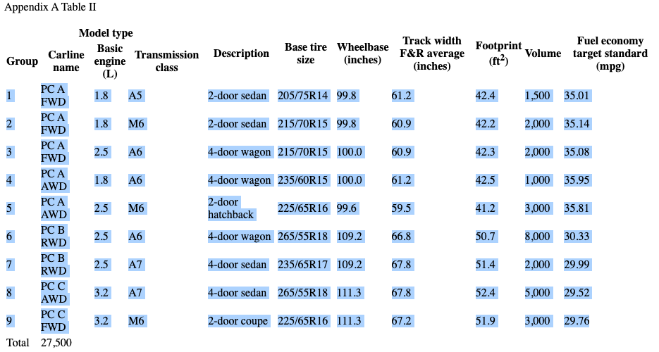
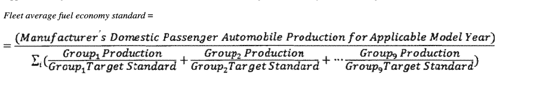
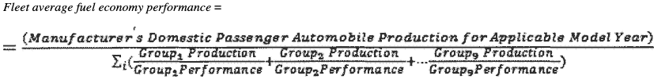

# corporate-average-fuel-consumption-calculator

This repository is reference implementation for CAFE calculation.

## System requirements
OS: macOS(m1 mac Mini)

## install requirements

```shell
$ python3 -m venv venv
$ source venv/bin/activate
$ pip install -r requirements.txt
```

## Data source

- [NHTSA-CAFE](https://www.nhtsa.gov/laws-regulations/corporate-average-fuel-economy)

# How to use

## load data

- Copy data table from Table2 to your clipboard.



- Open your ipython terminal.

```shell
$ ipython
```

- import pandas and copy data from clipboard to dataframe

```ipython
import pandas as pd

df = pd.read_clipboard(header=None)
df.columns = ['Group', 'Carline name', 'Basic engine(L)', 'Transmission class', 'Description', 'Base tire size', 'Wheelbase(inches)', 'Track width F&R average(inches)', 'Footprint(ft^2)', 'Volume', 'Fuel economy target standard(mpg)']
```

- But some columns is incorrect data type. Change them into int dtype.

```ipython
df.info()
<class 'pandas.core.frame.DataFrame'>
RangeIndex: 9 entries, 0 to 8
Data columns (total 11 columns):
 #   Column                             Non-Null Count  Dtype  
---  ------                             --------------  -----  
 0   Group                              9 non-null      int64  
 1   Carline name                       9 non-null      object 
 2   Basic engine(L)                    9 non-null      float64
 3   Transmission class                 9 non-null      object 
 4   Description                        9 non-null      object 
 5   Base tire size                     9 non-null      object 
 6   Wheelbase(inches)                  9 non-null      float64
 7   Track width F&R average(inches)    9 non-null      float64
 8   Footprint(ft^2)                    9 non-null      float64
 9   Volume                             9 non-null      object 
 10  Fuel economy target standard(mpg)  9 non-null      float64
dtypes: float64(5), int64(1), object(5)
memory usage: 920.0+ bytes

df["Volume"] = df["Volume"].str.replace(",", "")

df["Volume"] = df["Volume"].astype(int)

df.info()
<class 'pandas.core.frame.DataFrame'>
RangeIndex: 9 entries, 0 to 8
Data columns (total 11 columns):
 #   Column                             Non-Null Count  Dtype  
---  ------                             --------------  -----  
 0   Group                              9 non-null      int64  
 1   Carline name                       9 non-null      object 
 2   Basic engine(L)                    9 non-null      float64
 3   Transmission class                 9 non-null      object 
 4   Description                        9 non-null      object 
 5   Base tire size                     9 non-null      object 
 6   Wheelbase(inches)                  9 non-null      float64
 7   Track width F&R average(inches)    9 non-null      float64
 8   Footprint(ft^2)                    9 non-null      float64
 9   Volume                             9 non-null      int64  
 10  Fuel economy target standard(mpg)  9 non-null      float64
dtypes: float64(5), int64(2), object(4)
memory usage: 920.0+ bytes
```

## Fleet average fuel economy standard

- Official document show its formula like below.



- Numerator is

```ipython
numerator = df["Volume"].sum()
numerator
Out[15]: 27500
```

- Denomiator is

```ipython
df["Group production/target"] = df["Volume"] / df["Fuel economy target standard(mpg)"]

denomiator = df['Group production/target'].sum()
denomiator
Out[18]: 869.0018245725346
```

- Then the value is

```ipython
numerator / denomiator
Out[20]: 31.645503176621474
```

## Fleet average fuel economy performance

- Official document show its formula like below.



- Reload data from Table 1 to clipboard
- Drop unnecessary columns
- Rename each columns name
- Then convert each dtype for calculation

```ipython
df = pd.read_clipboard(header=None)

df.drop([7,8,9,10], axis=1, inplace=True)

df.columns = [
    ...:     "Group",
    ...:     "Carline name",
    ...:     "Basic engine(L)",
    ...:     "Transmission class",
    ...:     "Description",
    ...:     "Actual measured fuel economy(mpg)",
    ...:     "Volume",
    ...: ]

df.info()
<class 'pandas.core.frame.DataFrame'>
RangeIndex: 9 entries, 0 to 8
Data columns (total 7 columns):
 #   Column                             Non-Null Count  Dtype  
---  ------                             --------------  -----  
 0   Group                              9 non-null      int64  
 1   Carline name                       9 non-null      object 
 2   Basic engine(L)                    9 non-null      float64
 3   Transmission class                 9 non-null      object 
 4   Description                        9 non-null      object 
 5   Actual measured fuel economy(mpg)  9 non-null      float64
 6   Volume                             9 non-null      object 
dtypes: float64(2), int64(1), object(4)
memory usage: 632.0+ bytes

df["Volume"] = df["Volume"].str.replace(",", "")
df["Volume"] = df["Volume"].astype(int)

```

- Numerator is

```ipython
numerator = df["Volume"].sum()
numerator
Out[15]: 27500
```

- Denomiator is

```ipython
df["Group production/actual"] = df["Volume"] / df["Actual measured fuel economy(mpg)"]

denomiator = df['Group production/actual'].sum()
denomiator
Out[18]: 858.879907075473
```

- Then the value is

```ipython
numerator / denomiator
Out[20]: 32.01844608711223
```